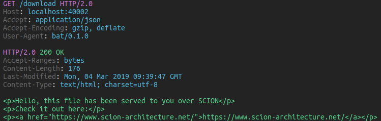
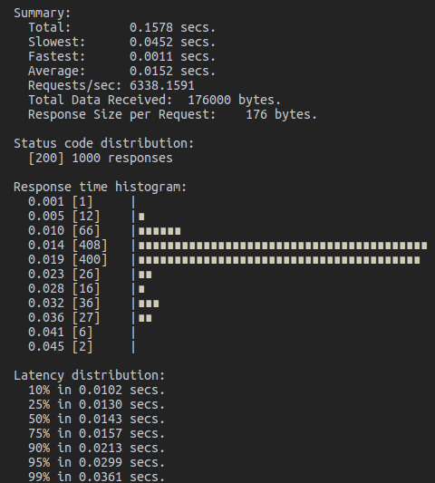

# bat ("cURL for SCION")

The [bat application](https://github.com/netsec-ethz/scion-apps/) is a cURL-like tool for sending HTTP requests to SCION enabled webservers and retrieve information in a human-readable format. Documentation is available in the [README.md](https://github.com/netsec-ethz/scion-apps/blob/master/bat/README.md).

## Install

To install `bat`, run:
```shell
sudo apt install scion-apps-bat
```
See [Installation](../install/pkg.md#applications) for details.

## Usage

The general usage of bat is: `bat [flags] [Method] URL [Item]`

### Flags

| Flag   | Meaning                                                                                                         |
| ------ | --------------------------------------------------------------------------------------------------------------- |
| -l     | local bind address                                                                                              |
| -b     | benchmarking mode                                                                                               |
| -b.N   | number of benchmark requests to send (default 1000)                                                             |
| -b.C   | number of parallel clients in benchmark (default 100)                                                           |
| -body  | Send raw data as body                                                                                           |
| -d     | download mode with progress bar                                                                                 |
| -f     | send data `application/x-www-form-urlencoded` (default false)                                                   |
| -j     | send data `application/json` encoded (default true)                                                             |
| -p     | pretty print JSON responses (default true)                                                                      |
| -print | A (all), H (request header), B (request body), h (response header), b (response body), any combination possible |
| -v     | show version number                                                                                             |

### Method

The method can be any of the regular HTTP methods. It defaults to GET if there is no data to send and to POST otherwise.

### URL

bat accepts both, SCION addresses and hostnames as URLs. Hostnames are resolved by scanning the `/etc/hosts/` file. New hosts can be added by simply including a line in that file.
Below you see an example:

```
# regular IPv4 hosts
# ....

# regular IPv6 hosts
# ....

# SCION hosts
18-ffaa:1:2,[10.0.8.10]	                                localhost
17-ffaa:0:1,[192.168.1.1]                               host1 host2
20-ffaa:c0ff:ee12,[0:0:0ff1:ce00:dead:10cc:baad:f00d]   host4
```

Consequently, these two calls are equivalent:

```
scion-bat https://17-ffaa:0:1,[192.168.1.1]:8080/route
```
```
scion-bat https://host1:8080/route
```


If no SCION localhost is defined in the `/etc/hosts` file like above, the local address needs to
be provided with the `-l` flag. E.g.:
```
scion-bat -l 18-ffaa:1:2,[10.0.8.10]:0 https://host1:8080/route
```

!!! note
    The scheme defaults to HTTPS, unencrypted HTTP is not supported

### Item

| Item               |                                  |
| ------------------ | -------------------------------- |
| key=value          | JSON/form-encoded key-value pair |
| key:value          | custom header                    |
| key=@/path/to/file | send file content as value       |

IO redirects (`<`, `>`) work as usual.

[//]: # (TODO Example servers below still built from sources. Come up with some ideas for servers to deploy in infrastructure.)

## Example servers

Two example server applications can be found in [scion-apps repository](https://github.com/netsec-ethz/scion-apps/tree/master/lib/shttp/examples).
[Minimal](https://github.com/netsec-ethz/scion-apps/tree/master/lib/shttp/examples/minimal) starts a server which defines two routes: `/download` downloads a small HTML file from the server. `/upload` prints the form encoded content of the request body to the console. They show the basic GET and POST capabilities of bat.
[Image-server](https://github.com/netsec-ethz/scion-apps/tree/master/lib/shttp/examples/image_server) has a single route, `/image` which lets the user download an image from the server and save it to disk. This example shows the download capabilities of bat.

To start any of the servers, run these commands in the respective folder:

```
openssl req -x509 -newkey rsa:1024 -keyout key.pem -nodes -out cert.pem -days 365 -subj '/CN=server'
```
```
server -local 17-ffaa:1:1,[10.0.0.15]:40002 -cert cert.pem -key key.pem
```

Make sure you give your server a name (e.g. server) by adding a line to `/etc/hosts`.
Then query it like so:


For the minimal server:

```
scion-bat server:40002/download
```

It should produce output similar to this:


```
scion-bat -f server:40002/upload foo=bar
```

Which prints `foo=bar` in the server's console, and

```
scion-bat -b server:40002/download
```

which runs a benchmark, producing output like this:




For the image server:

```
scion-bat -d server:40002/image
```

This places the downloaded image file in your current directory.

