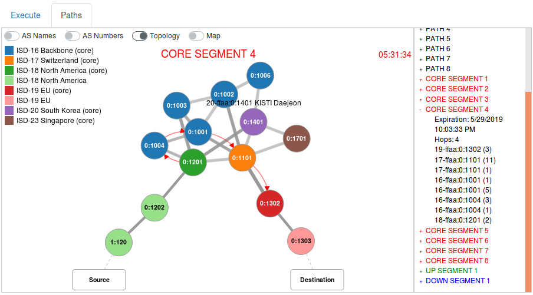
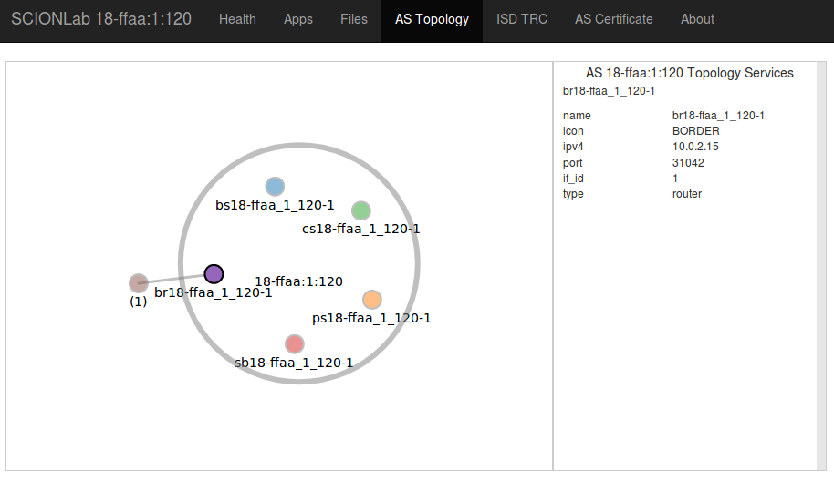

# Webapp AS Visualization

!!! TODO

    Check & update

    Decide on a name!? ;-)


## Webapp Setup

Webapp is a Go application that will serve up a static web portal to make it easy to visualize and experiment with SCIONLab test apps on a virtual machine.

### Build

```shell
mkdir $GOPATH/src/github.com/netsec-ethz
cd $GOPATH/src/github.com/netsec-ethz
git clone https://github.com/netsec-ethz/scion-apps.git
cd scion-apps
./deps.sh
make install
```

### Install

To install `webapp` (and all [SCIONLab apps](https://github.com/netsec-ethz/scion-apps)) and get dependencies as listed in vendor file:
```shell
./deps.sh
make install
```

### Run

!!! warning
    If the old [scion-viz](https://github.com/netsec-ethz/scion-viz) web server is running on your SCIONLab VM, port 8000 may still be in use. To remedy this, before `vagrant up`, make sure to edit your `vagrantfile` to provision an alternate port for the `webapp` web server. Add this line for a different port, say 8080 (for example, just choose any forwarding port not already in use by vagrant, and use that port everywhere below):

    ```
    config.vm.network "forwarded_port", guest: 8080, host: 8080, protocol: "tcp"
    ```

To run the Go Web UI at a specific address (-a) and port (-p) like 0.0.0.0:8000 for a SCIONLab VM use:
```shell
cd webapp
webapp -a 0.0.0.0 -p 8000
```
Now, open a web browser at [http://127.0.0.1:8000](http://127.0.0.1:8000), to begin.

## Browser AS Visualizations
Several menu options are available at the top of each `webapp` page, which are outlined below. Each of the features below use your SCIONLab IA the the source address.

### Health
The Health tab is the landing page for `webapp` that will automatically test your SCIONLab configuration for configuration and communication health. Additional help is available in our [troubleshooting guide](../tips/troubleshooting.md), if needed.


### Apps
The Apps tab provides a portal to SCIONLab Apps, and uses your Source IA and a Destination IA you specify to test with. Some default Destination IAs are already provided for you, but you can always change them and click `Update Paths`.

#### Paths
The announced paths will be displayed in a combined topology in the window. To view the details of a specific path expand the path's data by clicking on the path number in the window on right side. You may also view a global map of selected paths by clicking the `Map` switch.

#### Execute
See the [SCIONLab Apps Visualization](../as_visualization/webapp_apps.md) page for details about running SCIONLab Apps.



### Files
The `Files` menu on the page will allow you to navigate and serve any files on the SCIONLab node from the root (-r) directory you specified (if any) when starting webapp.go. To browse the user directory, for example:
```shell
webapp -a 0.0.0.0 -p 8000 -r ~
```
### AS Topology
The composition of services and border routers for the Source AS will be displayed in the AS Topology tab. Click on any circle to view the details of that server or router.

!!! tip
    The big circle can be clicked on as well to view details of the Source AS.



### ISD TRC


### AS Certificate


## Related Links
* [Webapp SCIONLab Apps Visualization](../as_visualization/webapp_apps.md)
* [Webapp Development Tips](../as_visualization/webapp_development.md)
* [Verifying the installation](../config/check.md)

