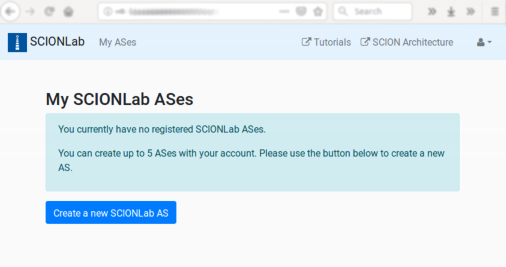
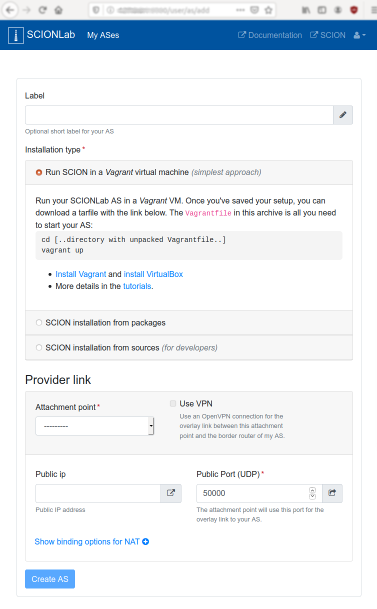

# Creating a SCIONLab AS

## SCIONLab Portal Overview

In order to create a SCIONLab AS you must login on [SCIONLab](https://www.scionlab.org). In case you don't have an account yet, please follow the registration process.

After logging in, you will land on the `My ASes` page.

* The `My ASes` link in the navbar brings you back to this page when you navigate away.
* The drop-down menu under the -symbol in the navbar contains links to change your password and to log out.

This view is initially empty, later you will see a list of your ASes:

* The columns in this summary refer to the configuration you've made for this AS, as discussed below.
* The link with the -symbol in the `AS ID` column  brings you to the edit page for an AS.
* The link with the -symbol in the `Configuration` column lets you download the configuration tarfile for an AS.
* The tick or cross in the `Active` column indicates whether an AS has been deactivated (using the corresponding button or check-boxes in the edit page).

## Configure a SCIONLab AS

The `Create a new SCIONLab AS` button or the edit link for an existing AS will bring you to the same configuration form.

-----

*   Label: here you can add a short label for your AS that will be displayed on the `My ASes` list page. This label just helps you identify your ASes and doesn't have any other functionality.

*   Installation Type: select the way you have installed or will install SCION. Please refer to [Installation/Pick an Option](../install/index.html).

-----

The following options configure the "Provider links" for your AS. For each of your ASes, you can create up to 5 overlay links to provider infrastructure ASes called "Attachment Points".
Each of these links is a Provider-Customer link in the SCION network topology, which cannot cross ISD (isolation domain) boundaries. Thus, you can create only links to Attachment Point ASes in the same ISD.

The interface is restricted to only add one link at a time. During creation of your AS, you can define (exactly) one "Provider link", later you can modify/add/remove links.

The following options configure each "Provider link", that is, the options define the parameters for the overlay link between the border router in your AS and the border router in an Attachment Point AS.

*   Attachment Point: this selects the provider AS to which a link will be established. This selection also determines the ISD  which your AS will belong to.

    For lower latency, prefer to pick an Attachment Point that is closest to you -- the topology map on the [SCIONLab home page](https://www.scionlab.org) has some hints on the geographical regions in which the ASes are located.

*   Use VPN: if enabled, an OpenVPN tunnel is configured between your AS and the chosen Attachment Point.

    The `IP address` options below will disappear, as the VPN-internal IP address will be used in the border router configuration.

    Use this option if:

    * you don't have a static public IP address or
    * you are **behind a NAT or firewall** and you cannot open/forward a chosen UDP port
    * you want to _"just make it work"_, as you'll need to know no further details about your network configuration

    The configuration file will contain an OpenVPN configuration file named `client-scionlab-${Parent_AS}.conf`.
    After extracting this file to `/etc/openvpn/`, you can start the tunnel by running `sudo systemctl start openvpn@client-scionlab-${Parent_AS}`.

*   Public IP Address, Bind IP Address

    Find your _public IP_ e.g. by visiting [whatsmyip.org](https://www.whatsmyip.org/) or by running

        dig +short myip.opendns.com @resolver1.opendns.com

    Find your _local IP_ address e.g. by running

        ip route get 8.8.8.8 | head -1 | cut -d' ' -f8

    If your host has a public IP (the public IP is identical with the local IP), only fill in the `Public IP Address` field and leave the `Bind IP Address` field blank.

    If you are in a network behind a NAT (i.e. the public IP and local IP are different), fill the `Public IP Address` field with the public IP and the `Bind IP Address` field with the local IP address.



*   Public Port, Bind Port:

    Choose a UDP port on which your Border Router will be reachable. We typically use ports in the range 50000-51000 by convention, but you're free to choose any other.

    If you are behind a NAT or firewall, make sure to open/forward the chosen port. For this you may need to contact your network administrator.
    If you have a port forwarding rule that rewrites the port number, enter the local port number in the `Bind Port` field, otherwise leave it blank.

## Download and install configuration

After creating or modifying your AS as described above, you can deploy the generated configuration to your machine.
The procedure for this depends on which type of SCION installation you chose. Please follow the instructions on the individual pages.

* [Instructions for `Run SCION in Vagrant virtual machine`](../install/vm.html)
* [Instructions for `SCION installation from packages`](../install/pkg.html)
* [Instructions for `SCION installation from sources`](../install/src.html)
